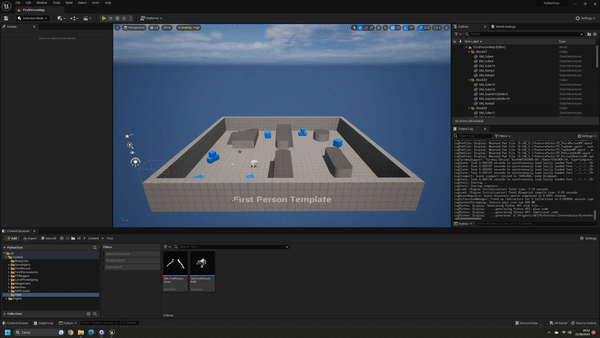
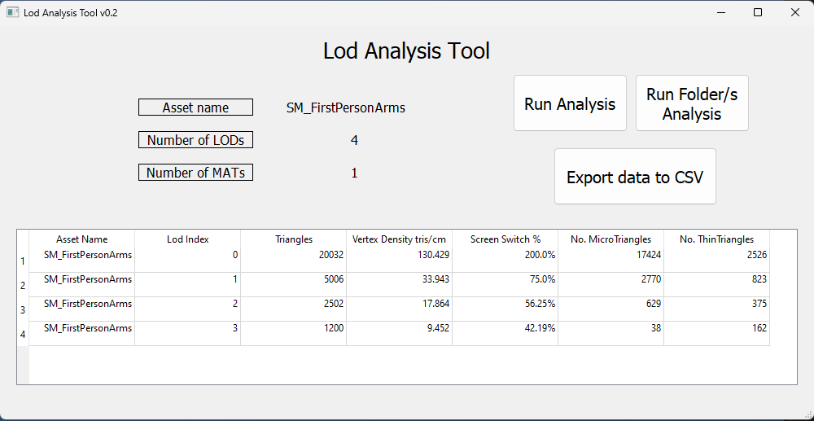

# LoD Analysis Tool

A simple Python tool integrated into UE5 to evaluate LoDs in the engine.

## Demo

Full demo on youtube, click the image below.

## Tech Stack

**Python** - PySide2

**QtDesigner**

**Unreal Engine Python API**

## Installation

Follow the official documentation to integrate Python in the Engine first.
https://docs.unrealengine.com/5.1/en-US/scripting-the-unreal-editor-using-python/

The **custom_menu_unreal.py**, **lod_analysis_tool.py**, **ToolGUI_ui.py**, and **ToolGUI.ui** must stay in the same folder.

You can run Python scripts in Unreal Engine by going to Tools>Execute Python Script.

Run the custom_menu_unreal.py script.

A new menu on the top bar will appear, you can then launch the tool from there.

## Usage

- Run the tool from the custom menu.
- Select a single/multiple StaticMesh asset/s from the content browser
- Click the "Run Analysis" button
- The data will appear on the screen.

If multiple assets are selected, only the first one will appear on the first half of the UI, the others will be shown in the table below.

You can export data to a CSV file with the "Export Data to CSV" button.

In the "Config" folder you'll find a config.json file that you can edit to customize how many Micro or Thin triangles are allowed and how are they calculated.
Be sure to do it with the tool closed.

## Screenshots

## Roadmap

- ~~Add a GUI to let the user decide the settings of the tool (thresholds for Micro, Thin Triangles, and allowed Vertex Density)~~
- ~~Let the user select a folder and run the analysis on it~~
- ~~Color-code the data to quickly outline if the mesh is valid or not~~
- Write a proper documentation

## Acknowledgements

- [Unreal .ui Template](https://gist.github.com/isaacoster/24375ae0fb84dda7aea916077df3f5f4)
- [Isaac Oster Youtube channel - Unreal python API tutorial](https://www.youtube.com/@IsaacOster)
- [How to write a Good readme](https://bulldogjob.com/news/449-how-to-write-a-good-readme-for-your-github-project)
